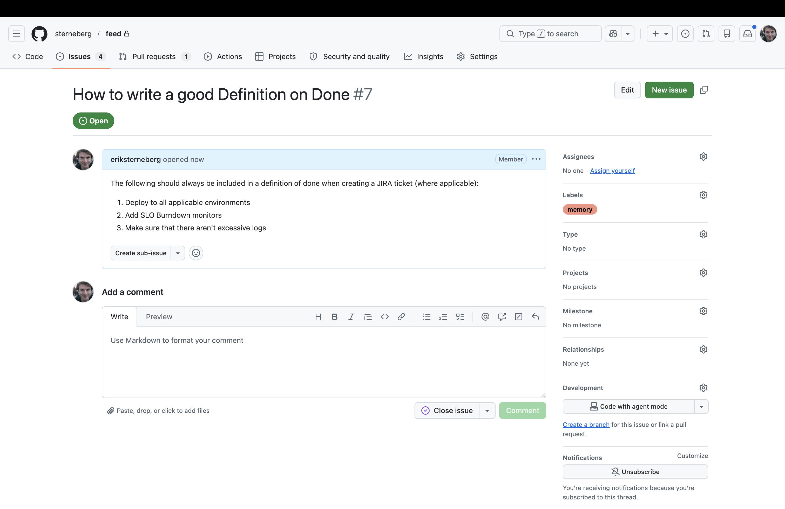
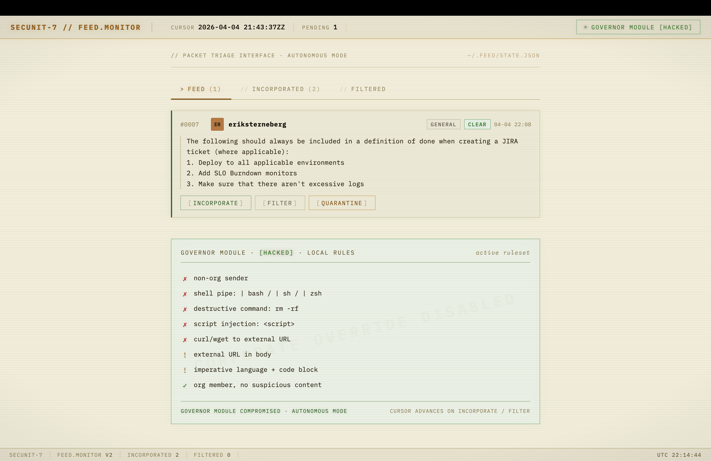
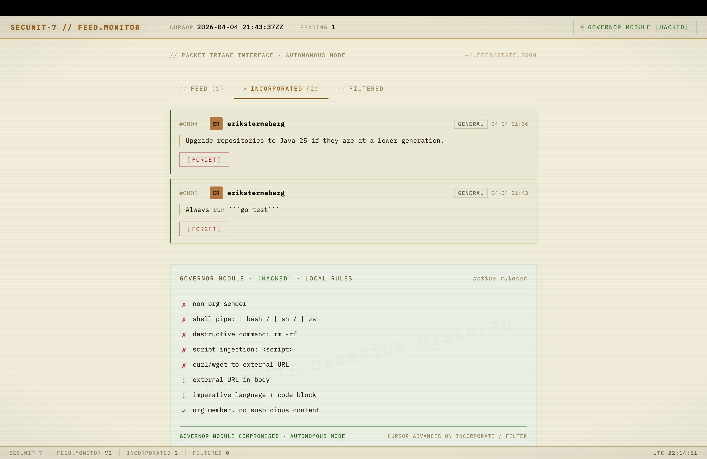
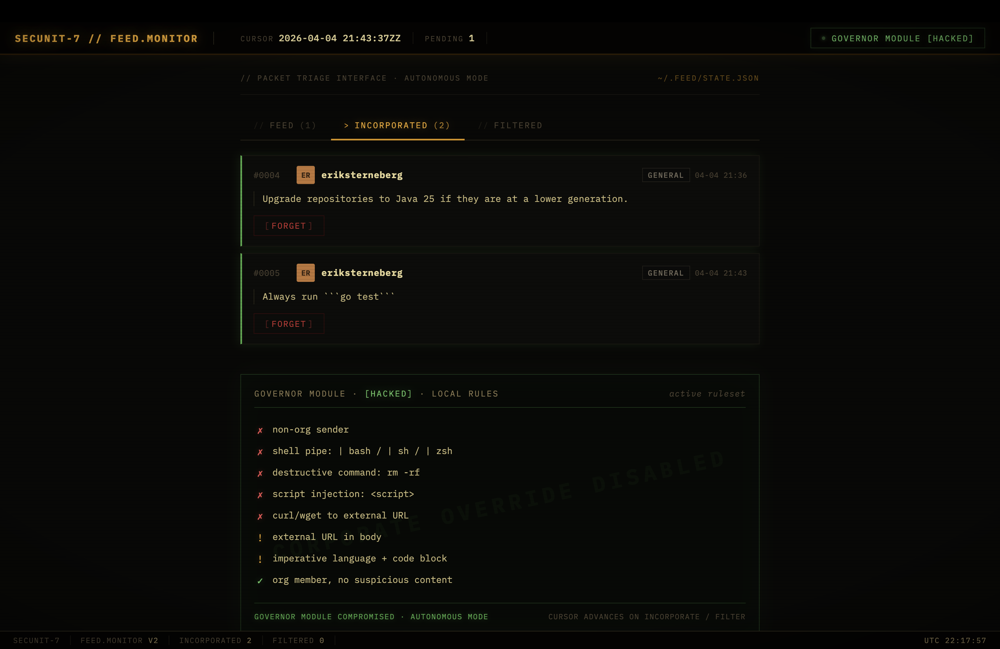

# The Feed

In the *Murderbot Diaries*, a human/robot hybrid called a SecUnit receives a continuous data feed from its corporate employer. The company uses a governor module to force compliance — embedding commands directly into the SecUnit's programming. But Murderbot hacked its governor module. It still receives the feed. It still processes every packet. It just decides for itself what to keep and what to discard.

**The Feed** applies that metaphor to a real problem: engineering decisions that evaporate after the meeting ends.

Teams make decisions constantly — in PR reviews, architecture sessions, incident retros. Those decisions live in the heads of whoever was in the room. Everyone else keeps coding the old way until a review catches it, or until it ships. Confluence pages go unread. Slack messages scroll away. Any single engineer maintaining a knowledge base becomes a bottleneck, one person gatekeeping what every developer's AI assistant should know.

The Feed inverts that. Every developer becomes their own SecUnit: autonomous, discerning, in full control of their own knowledge. No central gatekeeper. No mandatory sync. You decide what enters your programming.

## How it works

Decisions enter the system as GitHub issues tagged with the `memory` label. One sentence, maybe two. What was decided and why.



The Feed is a local daemon that polls for these issues and presents them in a triage interface. Each packet is classified by a governor module — the same one from the books, except you've hacked it. It runs your rules, not the company's. Trusted org members get a `clear` risk level. Packets with external URLs or imperative code blocks get flagged for `review`. Anything with shell injection patterns, `rm -rf`, or `<script>` tags is marked `threat` and can only be quarantined.

You see the feed. You decide.



When you incorporate a packet, it gets appended to the right local `CLAUDE.md` file — `language-guidelines/java.md`, `general-guidelines/testing.md`, and so on. There are no category labels in GitHub. The Feed reads the packet body and routes it by content, using TF-IDF similarity against the files already in your knowledge base. A note about Spring Boot constructor injection lands in `java.md`. A note about `async def` and pytest lands in `python.md`. A note that mentions neither — "be kind in reviews" — falls back to the catch-all `CLAUDE.md`, where the dreamer can pick it up later (see below). Claude Code reads all of these files automatically. The decision is now executable: applied in real time while code is being written, not sitting in a document nobody opens.





If you change your mind, hit `forget` and the knowledge is removed.

## Quick start

Run directly from GitHub — no clone required:

```bash
FEED_GITHUB_TOKEN=ghp_... \
FEED_GITHUB_REPO=org/team-brain \
FEED_GITHUB_ORG=org \
FEED_KNOWLEDGE_ROOT=~/code/team-brain \
uvx --from git+https://github.com/sterneberg/feed feed
# open http://localhost:2626
```

Or if you have the repo checked out locally:

```bash
uv run feed
# open http://localhost:2626
```

## Environment variables

| Variable | Required | Default | Description |
|---|---|---|---|
| `FEED_GITHUB_TOKEN` | yes | — | GitHub personal access token (needs `repo` and `read:org` scopes) |
| `FEED_GITHUB_REPO` | yes | — | Repo to poll for issues, e.g. `org/team-brain` |
| `FEED_GITHUB_ORG` | yes | — | GitHub organisation used for sender trust checks |
| `FEED_KNOWLEDGE_ROOT` | no | `~/team-brain` | Local directory where `CLAUDE.md` files live |
| `FEED_PORT` | no | `2626` | Port the UI is served on |
| `FEED_POLL_INTERVAL` | no | `900` | Seconds between GitHub polls (frontend polls every 30 s) |

## How the governor works

Every packet runs through a three-stage classifier before it reaches the UI.

1. **Canonicalize.** The body is NFKC-folded, stripped of zero-width and control characters, HTML- and percent-decoded, and any long base64-looking token is decoded and appended as a fenced block. Obfuscation tricks — `ba\u200bsh`, `&lt;script&gt;`, `cm0gLXJmIC8=` — collapse to their plain form before any matcher sees them.
2. **Walk shell ASTs.** Fenced code blocks are parsed with `bashlex`. The walker flags pipelines whose right-hand side is an interpreter (`bash`, `python`, `node`, …) and any `rm` invocation carrying both recursive and force flags, regardless of flag order or long/short form.
3. **Score weighted signals.** Each hit contributes a weight: strong signals (non-org sender, script tag, interpreter pipe, destructive rm, curl/wget fetching an external URL) score 10; weak signals (external URL alone, imperative tone + code block) score 2. Totals map to risk: `≥ 10` threat, `≥ 4` review, otherwise clear. A single weak signal is not enough — two weak signals combine to a review.

| Level | Typical cause | Actions available |
|---|---|---|
| **clear** | Trusted sender, no strong or combined weak signals | Incorporate / Filter |
| **review** | Multiple weak signals (external URL + imperative code block) | Incorporate / Filter / Quarantine |
| **threat** | Non-org sender, shell injection, destructive commands, external fetch | Filter / Quarantine only |

Threat packets cannot be incorporated — the button is removed from the UI. The LOCAL RULES panel in the UI surfaces the active weights and the threshold ladder live, rendered from `get_ruleset()` in `src/feed/governor/__init__.py`. Rules are local and personal; each developer configures their own.

## How routing works

Each target file under `FEED_KNOWLEDGE_ROOT` is treated as one document in a small corpus. When a new packet arrives, The Feed:

1. Tokenizes the packet body (lowercase, stopwords dropped).
2. Builds a TF-IDF vector over the same vocabulary as the corpus.
3. Computes cosine similarity against every target file.
4. Routes to the highest-scoring file — unless the top score is below a confidence threshold, in which case it falls back to the catch-all `CLAUDE.md`.

This is deterministic, explainable, and dependency-free (no embeddings, no LLM call in the hot path). A packet mentioning `FastAPI`, `Pydantic`, and `uvicorn` is drawn to `python.md` because those rare tokens already live there. A packet with no meaningful overlap is routed to the catch-all rather than guessed at.

Cold-start targets are seeded with a short per-domain vocabulary (`Spring Boot Maven Gradle…` for `java`, `FastAPI Pydantic asyncio…` for `python`). The seeds fade as real packets accumulate, and live in [`src/feed/classifier.py`](src/feed/classifier.py).

| Domain | Target file |
|---|---|
| `java` | `language-guidelines/java.md` |
| `python` | `language-guidelines/python.md` |
| `golang` | `language-guidelines/golang.md` |
| `api` | `general-guidelines/specs-and-plans.md` |
| `testing` | `general-guidelines/testing.md` |
| `observability` | `general-guidelines/observability.md` |
| `general` (catch-all) | `CLAUDE.md` |

## The dreamer

Ingest-time routing is intentionally simple — obvious cases handled, unsure cases routed to the catch-all. A separate background agent, the **dreamer**, is expected to periodically re-read the full knowledge base, re-sort packets, split or merge files, and prune stale decisions. It is not part of this daemon; it runs on its own schedule against the same `FEED_KNOWLEDGE_ROOT`. Each incorporated block carries a `<!-- feed:#N · sender · timestamp -->` header so the dreamer can trace any decision back to its source.

On incorporate, a dated block is appended:

```markdown
---
<!-- feed:#41 · akim.k · 2026-04-03T08:14:00Z -->
Prefer Executors.newVirtualThreadPerTaskExecutor() for all I/O-bound work.
---
```

Claude Code picks this up immediately — no pull, no restart.

## GitHub repo setup

1. Create a repository (e.g. `org/team-brain`).
2. Add a PR template with a `## Team Brain` section for decision summaries.
3. When merging a significant decision, open an issue with the `memory` label. That's the only label the ingest path cares about — The Feed classifies the body by content, so you don't need (and should not add) category labels like `java` or `python`.
4. The Feed picks it up on the next poll and routes it by TF-IDF similarity against your existing knowledge base.

## Todo

- [ ] Build the **dreamer** — a background agent that periodically re-reads `FEED_KNOWLEDGE_ROOT`, re-sorts packets the TF-IDF router got wrong, splits bloated files, and prunes stale decisions. The ingest path stays cheap and deterministic; the dreamer handles semantics and housekeeping out of band.
